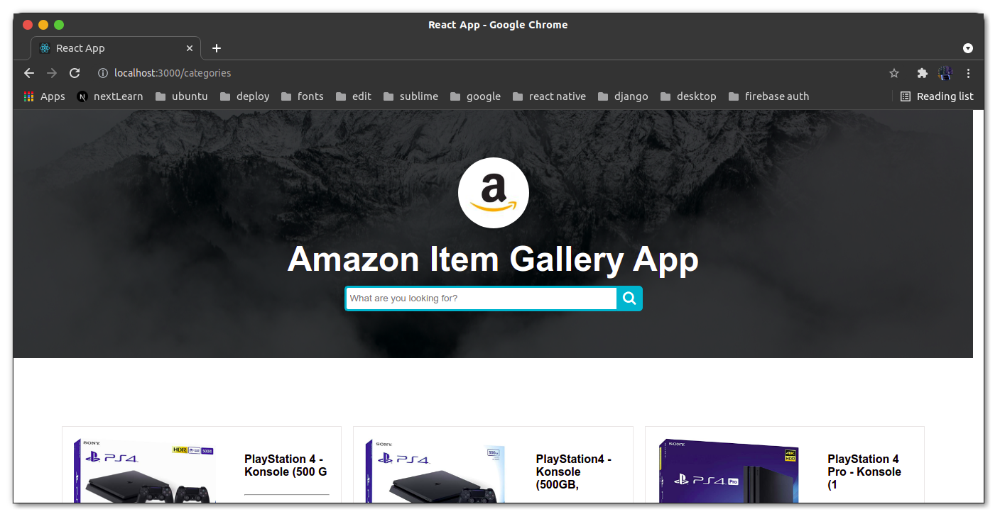

# This is a react redux gallery app



This is recreated project from jakobowsky youtube channel.
The frontend was html css and javascript but I decided to turn it into react redux project

This is the youtube video link [https://www.youtube.com/watch?v=7BMJTTsny6Y](https://www.youtube.com/watch?v=7BMJTTsny6Y)

to get started

1. Download the python project first from this link [https://github.com/jakobowsky/AmazonGalleryApp](https://github.com/jakobowsky/AmazonGalleryApp)

2. Then get the react project and run follow the steps bellow

```bash
yarn && yarn dev
# or
npm i && npm run dev
```

Open [http://localhost:3000](http://localhost:3000) with your browser to see the result.
